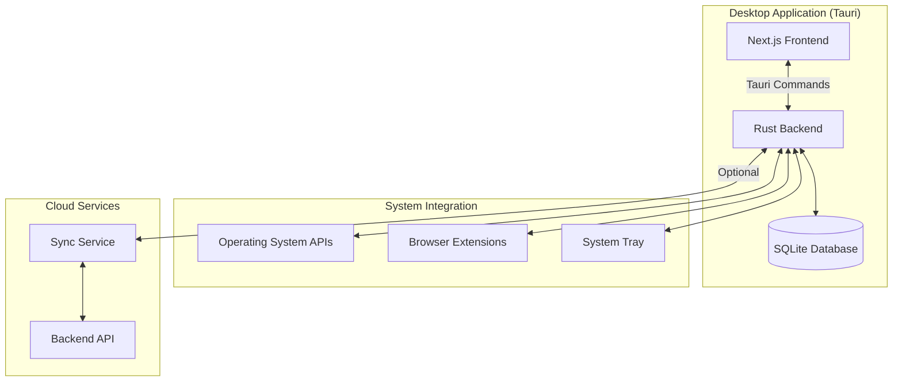

# Design Document: FocusForge Desktop Application

## Overview

The FocusForge Desktop Application is a unified native application built with Tauri that combines a Rust-based system monitoring backend with an embedded Next.js frontend. The application provides comprehensive activity tracking, real-time focus detection, and intelligent distraction management across Windows, macOS, and Linux platforms.

The design follows a local-first architecture where all monitoring data is stored in a local SQLite database by default, with optional cloud synchronization. The application runs as a single process that manages both the UI and monitoring systems, providing a seamless user experience similar to applications like Discord or Slack.

## Architecture

### High-Level Architecture



### Technology Stack

- **Application Framework**: Tauri 1.5+ (Rust + WebView)
- **Frontend**: Next.js 14+ (React 18+, TypeScript)
- **Backend**: Rust 1.70+ with Tokio async runtime
- **Database**: SQLite 3.40+ with sqlx for async queries
- **IPC**: Tauri command system for frontend-backend communication
- **Browser Integration**: Native messaging protocol (Chrome/Firefox)
- **Build System**: Cargo for Rust, npm/pnpm for frontend

### Process Architecture

The application runs as a single unified process with multiple threads:

1. **Main Thread**: Tauri application lifecycle, window management
2. **Monitoring Thread**: System activity polling and event processing
3. **Database Thread**: Async database operations via connection pool
4. **Sync Thread**: Background cloud synchronization (when enabled)
5. **WebView Thread**: Next.js application rendering

## Components and Interfaces

### 1. Tauri Application Shell

The main entry point that initializes all subsystems and manages the application lifecycle.

```rust
// src-tauri/src/main.rs
#[tauri::command]
async fn start_monitoring(state: State<'_, AppState>) -> Result<(), String> {
    state.monitoring_service.start().await
        .map_err(|e| e.to_string())
}

#[tauri::command]
async fn stop_monitoring(state: State<'_, AppState>) -> Result<(), String> {
    state.monitoring_service.stop().await
        .map_err(|e| e.to_string())
}

#[tauri::command]
async fn get_activity_logs(
    state: State<'_, AppState>,
    start_time: i64,
    end_time: i64
) -> Result<Vec<ActivityLog>, String> {
    state.database.get_logs(start_time, end_time).await
        .map_err(|e| e.to_string())
}

fn main() {
    tauri::Builder::default()
        .setup(|app| {
            // Initialize application state
            let app_state = AppState::new()?;
            app.manage(app_state);
            
            // Set up system tray
            setup_system_tray(app)?;
            
            // Initialize native messaging host
            setup_native_messaging()?;
            
            Ok(())
        })
        .invoke_handler(tauri::generate_handler![
            start_monitoring,
            stop_monitoring,
            get_activity_logs,
            start_focus_session,
            stop_focus_session,
            categorize_application,
            export_data,
            sync_to_cloud
        ])
        .run(tauri::generate_context!())
        .expect("error while running tauri application");
}
```

**Key Responsibilities**:
- Initialize all subsystems (monitoring, database, sync)
- Expose Tauri commands for frontend communication
- Manage application lifecycle and window state
- Handle system tray integration
- Configure native messaging host for browser extensions

### 2. Next.js Frontend Integration

The Next.js application is built as a static export and served directly by Tauri's WebView.

**Build Configuration** (`next.config.js`):
```javascript
module.exports = {
  output: 'export',
  distDir: '../src-tauri/dist',
  images: {
    unoptimized: true
  },
  assetPrefix: process.env.NODE_ENV === 'production' ? '' : undefined
}
```

**Tauri Configuration** (`tauri.conf.json`):
```json
{
  "build": {
    "distDir": "../dist",
    "devPath": "http://localhost:3000",
    "beforeDevCommand": "npm run dev",
    "beforeBuildCommand": "npm run build"
  },
  "tauri": {
    "windows": [
      {
        "title": "FocusForge",
        "width": 1200,
        "height": 800,
        "minWidth": 800,
        "minHeight": 600
      }
    ]
  }
}
```

**Frontend API Client** (`lib/tauri-api.ts`):
```typescript
import { invoke } from '@tauri-apps/api/tauri';

export interface ActivityLog {
  id: number;
  timestamp: number;
  application: string;
  category: string;
  duration: number;
}

export const tauriApi = {
  async startMonitoring(): Promise<void> {
    return invoke('start_monitoring');
  },
  
  async stopMonitoring(): Promise<void> {
    return invoke('stop_monitoring');
  },
  
  async getActivityLogs(startTime: number, endTime: number): Promise<ActivityLog[]> {
    return invoke('get_activity_logs', { startTime, endTime });
  },
  
  async startFocusSession(config: FocusSessionConfig): Promise<string> {
    return invoke('start_focus_session', { config });
  }
};
```

### 3. Monitoring System

The core monitoring system tracks application focus and browser activity across all platforms.

**Platform Abstraction**:
```rust
// src-tauri/src/monitoring/mod.rs
pub trait PlatformMonitor: Send + Sync {
    async fn get_active_application(&self) -> Result<ApplicationInfo>;
    async fn list_applications(&self) -> Result<Vec<ApplicationInfo>>;
    async fn subscribe_to_focus_events(&self) -> Result<Receiver<FocusEvent>>;
}

#[cfg(target_os = "windows")]
mod windows;
#[cfg(target_os = "macos")]
mod macos;
#[cfg(target_os = "linux")]
mod linux;

pub fn create_platform_monitor() -> Box<dyn PlatformMonitor> {
    #[cfg(target_os = "windows")]
    return Box::new(windows::WindowsMonitor::new());
    
    #[cfg(target_os = "macos")]
    return Box::new(macos::MacOSMonitor::new());
    
    #[cfg(target_os = "linux")]
    return Box::new(linux::LinuxMonitor::new());
}
```

**Monitoring Service**:
```rust
// src-tauri/src/monitoring/service.rs
pub struct MonitoringService {
    platform_monitor: Box<dyn PlatformMonitor>,
    database: Arc<Database>,
    current_session: Arc<RwLock<Option<FocusSession>>>,
    notification_sender: Sender<NotificationEvent>,
}

impl MonitoringService {
    pub async fn start(&self) -> Result<()> {
        let mut focus_events = self.platform_monitor.subscribe_to_focus_events().await?;
        
        while let Some(event) = focus_events.recv().await {
            self.handle_focus_event(event).await?;
        }
        
        Ok(())
    }
    
    async fn handle_focus_event(&self, event: FocusEvent) -> Result<()> {
        // Record activity log
        let log = ActivityLog {
            timestamp: event.timestamp,
            application: event.application.name.clone(),
            process_id: event.application.process_id,
            duration: 0, // Updated when focus changes
        };
        self.database.insert_activity_log(log).await?;
        
        // Check for distractions during focus session
        if let Some(session) = self.current_session.read().await.as_ref() {
            if !session.is_productive(&event.application) {
                self.notification_sender.send(NotificationEvent::Distraction {
                    application: event.application.name,
                    session_id: session.id,
                }).await?;
            }
        }
        
        Ok(())
    }
}
```

### 4. Database Layer

SQLite database with async operations for all data persistence.

**Schema**:
```sql
-- Activity logs
CREATE TABLE activity_logs (
    id INTEGER PRIMARY KEY AUTOINCREMENT,
    timestamp INTEGER NOT NULL,
    application TEXT NOT NULL,
    process_id INTEGER,
    category TEXT,
    duration INTEGER NOT NULL,
    url TEXT,
    page_title TEXT,
    browser TEXT
);

-- Application categories
CREATE TABLE application_categories (
    application TEXT PRIMARY KEY,
    category TEXT NOT NULL,
    custom BOOLEAN DEFAULT FALSE
);

-- Focus sessions
CREATE TABLE focus_sessions (
    id TEXT PRIMARY KEY,
    start_time INTEGER NOT NULL,
    end_time INTEGER,
    productive_categories TEXT NOT NULL,
    goal TEXT,
    status TEXT NOT NULL
);

-- Distraction events
CREATE TABLE distraction_events (
    id INTEGER PRIMARY KEY AUTOINCREMENT,
    session_id TEXT NOT NULL,
    timestamp INTEGER NOT NULL,
    application TEXT NOT NULL,
    marked_intentional BOOLEAN DEFAULT FALSE,
    FOREIGN KEY (session_id) REFERENCES focus_sessions(id)
);

CREATE INDEX idx_activity_timestamp ON activity_logs(timestamp);
CREATE INDEX idx_session_time ON focus_sessions(start_time, end_time);
```

**Database Service**:
```rust
// src-tauri/src/database/mod.rs
use sqlx::{SqlitePool, sqlite::SqlitePoolOptions};

pub struct Database {
    pool: SqlitePool,
}

impl Database {
    pub async fn new(path: &str) -> Result<Self> {
        let pool = SqlitePoolOptions::new()
            .max_connections(5)
            .connect(&format!("sqlite:{}", path))
            .await?;
        
        // Run migrations
        sqlx::migrate!("./migrations").run(&pool).await?;
        
        Ok(Self { pool })
    }
    
    pub async fn insert_activity_log(&self, log: ActivityLog) -> Result<i64> {
        let id = sqlx::query!(
            "INSERT INTO activity_logs (timestamp, application, process_id, category, duration, url, page_title, browser)
             VALUES (?, ?, ?, ?, ?, ?, ?, ?)",
            log.timestamp,
            log.application,
            log.process_id,
            log.category,
            log.duration,
            log.url,
            log.page_title,
            log.browser
        )
        .execute(&self.pool)
        .await?
        .last_insert_rowid();
        
        Ok(id)
    }
    
    pub async fn get_logs(&self, start_time: i64, end_time: i64) -> Result<Vec<ActivityLog>> {
        let logs = sqlx::query_as!(
            ActivityLog,
            "SELECT * FROM activity_logs WHERE timestamp BETWEEN ? AND ? ORDER BY timestamp",
            start_time,
            end_time
        )
        .fetch_all(&self.pool)
        .await?;
        
        Ok(logs)
    }
}
```

### 5. Browser Extension Integration

Native messaging host enables communication between browser extensions and the desktop app.

**Native Messaging Host Manifest** (Chrome):
```json
{
  "name": "com.focusforge.native",
  "description": "FocusForge Native Messaging Host",
  "path": "/path/to/focusforge-native-host",
  "type": "stdio",
  "allowed_origins": [
    "chrome-extension://[extension-id]/"
  ]
}
```

**Native Messaging Protocol**:
```rust
// src-tauri/src/native_messaging/mod.rs
#[derive(Serialize, Deserialize)]
#[serde(tag = "type")]
enum NativeMessage {
    TabChange {
        url: String,
        title: String,
        browser: String,
        timestamp: i64,
    },
    Ping,
    GetStatus,
}

pub struct NativeMessagingHost {
    database: Arc<Database>,
}

impl NativeMessagingHost {
    pub async fn handle_message(&self, message: NativeMessage) -> Result<serde_json::Value> {
        match message {
            NativeMessage::TabChange { url, title, browser, timestamp } => {
                let log = ActivityLog {
                    timestamp,
                    application: browser.clone(),
                    url: Some(url),
                    page_title: Some(title),
                    browser: Some(browser),
                    ..Default::default()
                };
                self.database.insert_activity_log(log).await?;
                Ok(json!({"status": "ok"}))
            }
            NativeMessage::Ping => {
                Ok(json!({"status": "ok", "version": env!("CARGO_PKG_VERSION")}))
            }
            NativeMessage::GetStatus => {
                Ok(json!({"connected": true}))
            }
        }
    }
}
```

**Browser Extension** (TypeScript):
```typescript
// extension/background.ts
let port: chrome.runtime.Port | null = null;

function connectNativeHost() {
  port = chrome.runtime.connectNative('com.focusforge.native');
  
  port.onMessage.addListener((message) => {
    console.log('Received from native host:', message);
  });
  
  port.onDisconnect.addListener(() => {
    console.log('Disconnected from native host');
    port = null;
    // Retry connection after 5 seconds
    setTimeout(connectNativeHost, 5000);
  });
}

chrome.tabs.onActivated.addListener(async (activeInfo) => {
  const tab = await chrome.tabs.get(activeInfo.tabId);
  if (port && tab.url) {
    port.postMessage({
      type: 'TabChange',
      url: tab.url,
      title: tab.title || '',
      browser: 'chrome',
      timestamp: Date.now()
    });
  }
});

connectNativeHost();
```

### 6. Focus Session Manager

Manages focus sessions with real-time distraction detection.

```rust
// src-tauri/src/focus/mod.rs
pub struct FocusSession {
    pub id: String,
    pub start_time: i64,
    pub end_time: Option<i64>,
    pub productive_categories: HashSet<String>,
    pub goal: Option<String>,
    pub status: SessionStatus,
}

pub struct FocusSessionManager {
    database: Arc<Database>,
    current_session: Arc<RwLock<Option<FocusSession>>>,
    notification_service: Arc<NotificationService>,
}

impl FocusSessionManager {
    pub async fn start_session(&self, config: FocusSessionConfig) -> Result<String> {
        let session = FocusSession {
            id: Uuid::new_v4().to_string(),
            start_time: chrono::Utc::now().timestamp(),
            end_time: None,
            productive_categories: config.productive_categories,
            goal: config.goal,
            status: SessionStatus::Active,
        };
        
        self.database.insert_focus_session(&session).await?;
        *self.current_session.write().await = Some(session.clone());
        
        Ok(session.id)
    }
    
    pub async fn check_distraction(&self, app: &ApplicationInfo) -> Result<bool> {
        let session = self.current_session.read().await;
        if let Some(session) = session.as_ref() {
            let category = self.database.get_application_category(&app.name).await?;
            if !session.productive_categories.contains(&category) {
                // Record distraction event
                self.database.insert_distraction_event(
                    &session.id,
                    chrono::Utc::now().timestamp(),
                    &app.name
                ).await?;
                
                // Send notification
                self.notification_service.send_distraction_alert(&app.name).await?;
                
                return Ok(true);
            }
        }
        Ok(false)
    }
}
```

### 7. Notification Service

Cross-platform notification system using native OS APIs.

```rust
// src-tauri/src/notifications/mod.rs
use notify_rust::Notification;

pub struct NotificationService {
    settings: Arc<RwLock<NotificationSettings>>,
}

impl NotificationService {
    pub async fn send_distraction_alert(&self, app_name: &str) -> Result<()> {
        let settings = self.settings.read().await;
        if !settings.enabled {
            return Ok(());
        }
        
        Notification::new()
            .summary("Focus Alert")
            .body(&format!("You switched to {} - Stay focused!", app_name))
            .icon("focusforge-icon")
            .timeout(settings.duration_ms)
            .action("return", "Return to Work")
            .action("break", "Take a Break")
            .show()?;
        
        Ok(())
    }
}
```

### 8. Sync Service

Optional cloud synchronization with conflict resolution.

```rust
// src-tauri/src/sync/mod.rs
pub struct SyncService {
    database: Arc<Database>,
    api_client: ApiClient,
    enabled: Arc<AtomicBool>,
}

impl SyncService {
    pub async fn sync(&self) -> Result<SyncResult> {
        if !self.enabled.load(Ordering::Relaxed) {
            return Ok(SyncResult::Disabled);
        }
        
        // Get local changes since last sync
        let last_sync = self.database.get_last_sync_timestamp().await?;
        let local_logs = self.database.get_logs_since(last_sync).await?;
        
        // Upload to cloud
        let response = self.api_client.upload_logs(local_logs).await?;
        
        // Download remote changes
        let remote_logs = self.api_client.get_logs_since(last_sync).await?;
        
        // Merge with conflict resolution (last-write-wins)
        for log in remote_logs {
            self.database.upsert_activity_log(log).await?;
        }
        
        // Update sync timestamp
        self.database.set_last_sync_timestamp(chrono::Utc::now().timestamp()).await?;
        
        Ok(SyncResult::Success {
            uploaded: response.count,
            downloaded: remote_logs.len(),
        })
    }
}
```

## Data Models

### Core Data Structures

```rust
// src-tauri/src/models/mod.rs

#[derive(Debug, Clone, Serialize, Deserialize)]
pub struct ApplicationInfo {
    pub name: String,
    pub process_id: u32,
    pub bundle_id: Option<String>,
    pub executable_path: String,
}

#[derive(Debug, Clone, Serialize, Deserialize)]
pub struct ActivityLog {
    pub id: Option<i64>,
    pub timestamp: i64,
    pub application: String,
    pub process_id: Option<u32>,
    pub category: Option<String>,
    pub duration: i64,
    pub url: Option<String>,
    pub page_title: Option<String>,
    pub browser: Option<String>,
}

#[derive(Debug, Clone, Serialize, Deserialize)]
pub struct ApplicationCategory {
    pub application: String,
    pub category: String,
    pub custom: bool,
}

#[derive(Debug, Clone, Serialize, Deserialize)]
pub struct FocusSessionConfig {
    pub productive_categories: HashSet<String>,
    pub goal: Option<String>,
    pub duration_minutes: Option<u32>,
}

#[derive(Debug, Clone, Serialize, Deserialize)]
pub enum SessionStatus {
    Active,
    Paused,
    Completed,
}

#[derive(Debug, Clone, Serialize, Deserialize)]
pub struct DistractionEvent {
    pub id: Option<i64>,
    pub session_id: String,
    pub timestamp: i64,
    pub application: String,
    pub marked_intentional: bool,
}
```

### TypeScript Models (Frontend)

```typescript
// types/models.ts

export interface ActivityLog {
  id: number;
  timestamp: number;
  application: string;
  processId?: number;
  category?: string;
  duration: number;
  url?: string;
  pageTitle?: string;
  browser?: string;
}

export interface ApplicationCategory {
  application: string;
  category: 'Productive' | 'Neutral' | 'Distracting' | string;
  custom: boolean;
}

export interface FocusSession {
  id: string;
  startTime: number;
  endTime?: number;
  productiveCategories: string[];
  goal?: string;
  status: 'Active' | 'Paused' | 'Completed';
}

export interface SessionSummary {
  sessionId: string;
  totalDuration: number;
  focusTime: number;
  distractionCount: number;
  applicationBreakdown: Record<string, number>;
  productivityScore: number;
}
```


## Correctness Properties

*A property is a characteristic or behavior that should hold true across all valid executions of a system—essentially, a formal statement about what the system should do. Properties serve as the bridge between human-readable specifications and machine-verifiable correctness guarantees.*

### Property Reflection

After analyzing all acceptance criteria, several redundancies were identified:
- Properties 1.2 and 12.3 both test startup time (consolidated into Property 1)
- Properties 6.4 and 7.1 both test distraction notification timing (consolidated into Property 7)
- Multiple properties test similar round-trip behaviors (database persistence, sync, export)
- Platform compatibility tests (11.1-11.3) are better handled as examples rather than separate properties

The following properties represent the unique, non-redundant correctness guarantees for the system:

### Core Application Properties

**Property 1: Unified process startup**
*For any* application launch, starting the Desktop_App should initialize both the Next_App and Monitoring_System in a single process, with the UI displayed within 3 seconds.
**Validates: Requirements 1.1, 1.2**

**Property 2: Process independence**
*For any* Desktop_App operation, no external processes or terminal commands should be required for full functionality.
**Validates: Requirements 1.3**

**Property 3: System tray minimization**
*For any* window close event, the Desktop_App should minimize to the system tray rather than terminating, keeping the process and monitoring active.
**Validates: Requirements 1.4**

**Property 4: Embedded Next.js serving**
*For any* Desktop_App instance, the Next_App should be served locally without external web servers, with all features functional.
**Validates: Requirements 2.1, 2.2**

**Property 5: Tauri command availability**
*For any* required backend operation, a corresponding Tauri command should be registered and callable from the Next_App.
**Validates: Requirements 2.3, 2.5**

### Monitoring Properties

**Property 6: Application enumeration completeness**
*For any* system with installed applications, the Monitoring_System should enumerate all applications and include known system applications.
**Validates: Requirements 3.1**

**Property 7: Focus detection latency**
*For any* application focus change, the Monitoring_System should detect and record the change within 1 second.
**Validates: Requirements 3.2, 4.4**

**Property 8: Activity log creation**
*For any* application focus event, the Monitoring_System should create a timestamped Activity_Log entry with application name and process identifier.
**Validates: Requirements 3.3**

**Property 9: Duration calculation accuracy**
*For any* application focus period, the recorded duration should match the actual time between focus gain and focus loss events within 1 second accuracy.
**Validates: Requirements 3.4**

**Property 10: Multi-workspace tracking**
*For any* workspace or virtual desktop switch, application tracking should continue without interruption or data loss.
**Validates: Requirements 3.5**

### Browser Integration Properties

**Property 11: Browser activity recording**
*For any* tab change event received from a Browser_Extension, the Monitoring_System should create an Activity_Log entry with URL, page title, and browser name.
**Validates: Requirements 4.2, 4.3**

**Property 12: URL duration tracking**
*For any* unique URL visited, the Monitoring_System should accumulate and track total time spent on that URL across multiple visits.
**Validates: Requirements 4.5**

**Property 13: Multi-browser support**
*For any* set of connected browsers, the Monitoring_System should track activity from all browsers independently and correctly.
**Validates: Requirements 4.6**

**Property 14: Native messaging protocol compliance**
*For any* message sent by a Browser_Extension, the message should conform to the defined JSON schema and be processed successfully.
**Validates: Requirements 13.4**

**Property 15: Privacy-preserving tracking**
*For any* browser tracking operation, only the active tab URL should be recorded, never background or inactive tabs.
**Validates: Requirements 13.5**

### Categorization Properties

**Property 16: Category persistence round-trip**
*For any* application category change, saving the change and then reading it back should return the updated category value.
**Validates: Requirements 5.3**

**Property 17: Custom category support**
*For any* user-defined category name, the system should allow creating, assigning, and persisting that category to applications.
**Validates: Requirements 5.4**

**Property 18: Session-scoped category overrides**
*For any* temporary category override during a Focus_Session, the override should apply only within that session and not persist after session end.
**Validates: Requirements 5.5**

### Focus Session Properties

**Property 19: Continuous session monitoring**
*For any* active Focus_Session, the Monitoring_System should continuously track the focused application without gaps or missed events.
**Validates: Requirements 6.2**

**Property 20: Distraction detection accuracy**
*For any* application switch during a Focus_Session, if the new application is not in the productive categories, a Distraction_Event should be created.
**Validates: Requirements 6.3**

**Property 21: Distraction notification timing**
*For any* Distraction_Event, a notification should be displayed within 1 second of the event occurrence.
**Validates: Requirements 6.4, 7.1**

**Property 22: Session summary completeness**
*For any* completed Focus_Session, the generated summary should include total focus time, distraction count, and time breakdown by application, with all values calculated correctly from Activity_Log data.
**Validates: Requirements 6.5**

**Property 23: Session pause/resume data integrity**
*For any* Focus_Session that is paused and resumed, all tracking data should be preserved and duration calculations should exclude paused time.
**Validates: Requirements 6.6**

**Property 24: Notification content completeness**
*For any* distraction notification, the notification should include the distracting application name and a quick action to return to the last productive application.
**Validates: Requirements 7.3**

**Property 25: Intentional break exclusion**
*For any* Distraction_Event marked as "intentional break", that event should be excluded from distraction count and productivity score calculations.
**Validates: Requirements 7.4**

**Property 26: Extended distraction follow-up**
*For any* distraction lasting more than 5 minutes, a follow-up reminder notification should be sent.
**Validates: Requirements 7.5**

### Analytics Properties

**Property 27: Report time range accuracy**
*For any* analytics report (daily, weekly, monthly), the included Activity_Log entries should exactly match the specified time range.
**Validates: Requirements 8.1**

**Property 28: Chart data consistency**
*For any* analytics visualization, the chart data should match the underlying Activity_Log data with no discrepancies in totals or breakdowns.
**Validates: Requirements 8.2**

**Property 29: Productivity score calculation**
*For any* set of Activity_Log entries, the productivity score should be calculated as (productive_time / total_time) * 100, with correct categorization of each entry.
**Validates: Requirements 8.3**

**Property 30: Distraction ranking accuracy**
*For any* analytics period, the most distracting applications should be ranked by total time spent in distracting-category applications, in descending order.
**Validates: Requirements 8.4**

**Property 31: Session success rate calculation**
*For any* set of Focus_Sessions, the success rate should be calculated as (sessions_without_distractions / total_sessions) * 100.
**Validates: Requirements 8.5**

### Data Storage Properties

**Property 32: SQLite persistence**
*For any* Activity_Log entry written to the database, the entry should be retrievable after application restart with all fields intact.
**Validates: Requirements 9.1**

**Property 33: Offline functionality**
*For any* core feature (monitoring, focus sessions, analytics), the feature should function correctly without internet connectivity.
**Validates: Requirements 9.2**

**Property 34: Database initialization idempotence**
*For any* application start, if the database doesn't exist it should be created, and if it exists it should be opened without data loss.
**Validates: Requirements 9.3**

**Property 35: Data retention policy enforcement**
*For any* configured retention period, Activity_Log entries older than the period should be automatically deleted, and entries within the period should be preserved.
**Validates: Requirements 9.4**

**Property 36: Data export round-trip**
*For any* data export operation, the exported data should match the database contents for the specified date range, with all fields present.
**Validates: Requirements 9.6, 18.1, 18.2**

**Property 37: Export performance**
*For any* export of 30 days of data, the operation should complete within 10 seconds.
**Validates: Requirements 18.5**

### Synchronization Properties

**Property 38: Periodic sync execution**
*For any* enabled Sync_Service with configured interval, sync operations should execute at the specified interval (±10% tolerance).
**Validates: Requirements 10.2**

**Property 39: Conflict resolution consistency**
*For any* sync conflict between local and cloud data, the last-write-wins strategy should be applied consistently, with the most recent timestamp winning.
**Validates: Requirements 10.3**

**Property 40: Offline sync queue**
*For any* sync operation attempted while offline, the operation should be queued and automatically retried when connectivity is restored.
**Validates: Requirements 10.5**

### Performance Properties

**Property 41: CPU usage efficiency**
*For any* 5-minute monitoring period during background operation, average CPU usage should be less than 5%.
**Validates: Requirements 12.1**

**Property 42: Memory usage efficiency**
*For any* normal operation state, RAM usage should be less than 150MB.
**Validates: Requirements 12.2**

**Property 43: Battery-aware monitoring**
*For any* power state change from AC to battery, monitoring frequency should be reduced, and when returning to AC, frequency should be restored.
**Validates: Requirements 12.5**

### Keyboard Shortcut Properties

**Property 44: Global shortcut functionality**
*For any* registered global keyboard shortcut, triggering the shortcut should execute the associated action within 500 milliseconds.
**Validates: Requirements 16.1, 16.2, 16.3, 16.5**

**Property 45: Shortcut customization persistence**
*For any* keyboard shortcut customization, saving the new shortcut and restarting the application should preserve the customization.
**Validates: Requirements 16.4**

**Property 46: Shortcut conflict detection**
*For any* keyboard shortcut that conflicts with an existing system or application shortcut, the conflict should be detected and the user should be notified.
**Validates: Requirements 16.6**

### Notification Properties

**Property 47: Native notification API usage**
*For any* notification displayed, the notification should use the platform's native notification API (Windows: WinRT, macOS: NSUserNotification, Linux: libnotify).
**Validates: Requirements 17.1**

**Property 48: Notification auto-dismiss**
*For any* notification with configured timeout, the notification should be automatically dismissed after the timeout period (±500ms tolerance).
**Validates: Requirements 17.3**

**Property 49: Do Not Disturb respect**
*For any* notification attempt while OS Do Not Disturb is enabled, the notification should be suppressed and queued in notification history.
**Validates: Requirements 17.5**

**Property 50: Notification history persistence**
*For any* notification displayed, the notification should be recorded in history and accessible from the system tray menu.
**Validates: Requirements 17.6**

### Security Properties

**Property 51: No third-party data transmission**
*For any* network request made by the Desktop_App, the destination should be either the configured cloud backend or update server, never third-party domains.
**Validates: Requirements 14.4**

**Property 52: HTTPS enforcement**
*For any* cloud backend communication, the connection should use HTTPS with valid certificate verification.
**Validates: Requirements 14.5**

**Property 53: Input sanitization**
*For any* data received from Browser_Extensions, the data should be validated against the schema and sanitized to prevent injection attacks before processing.
**Validates: Requirements 14.6**

### Update Properties

**Property 54: Update check execution**
*For any* application start, an update check should be performed within 10 seconds of startup.
**Validates: Requirements 19.1**

**Property 55: Update data preservation**
*For any* update installation, all Local_Database data and user settings should be preserved and accessible after the update completes.
**Validates: Requirements 19.4**

### Error Handling Properties

**Property 56: Error logging completeness**
*For any* error or warning that occurs, an entry should be written to the log file with timestamp, error type, and stack trace.
**Validates: Requirements 20.2**

**Property 57: Database corruption recovery**
*For any* detected database corruption, an automatic recovery attempt should be made, and the user should be notified of the outcome (success or failure).
**Validates: Requirements 20.5**

## Error Handling

### Error Categories

1. **System Permission Errors**
   - Missing accessibility permissions (macOS)
   - Missing screen recording permissions (macOS)
   - Insufficient privileges (Windows UAC)
   - Handle with clear user guidance and permission request flows

2. **Database Errors**
   - Corruption detection and automatic recovery
   - Disk space exhaustion
   - Lock contention
   - Implement automatic backups before risky operations

3. **Network Errors**
   - Sync service connection failures
   - Update check failures
   - Browser extension communication failures
   - Implement exponential backoff retry logic

4. **Monitoring Errors**
   - Platform API failures
   - Application enumeration failures
   - Focus detection failures
   - Graceful degradation with user notification

### Error Recovery Strategies

**Database Corruption**:
```rust
async fn recover_database(db_path: &Path) -> Result<RecoveryStatus> {
    // 1. Create backup of corrupted database
    let backup_path = db_path.with_extension("db.backup");
    fs::copy(db_path, &backup_path).await?;
    
    // 2. Attempt SQLite recovery
    let recovery_result = sqlx::query("PRAGMA integrity_check")
        .fetch_one(&pool)
        .await;
    
    match recovery_result {
        Ok(_) => {
            // Database is recoverable
            sqlx::query("VACUUM").execute(&pool).await?;
            Ok(RecoveryStatus::Success)
        }
        Err(_) => {
            // Database is unrecoverable, create new database
            fs::remove_file(db_path).await?;
            Database::new(db_path).await?;
            Ok(RecoveryStatus::Recreated)
        }
    }
}
```

**Permission Errors**:
```rust
async fn check_permissions() -> Result<PermissionStatus> {
    #[cfg(target_os = "macos")]
    {
        let accessibility = check_accessibility_permission();
        let screen_recording = check_screen_recording_permission();
        
        if !accessibility || !screen_recording {
            return Ok(PermissionStatus::Missing {
                accessibility,
                screen_recording,
            });
        }
    }
    
    Ok(PermissionStatus::Granted)
}
```

**Network Retry Logic**:
```rust
async fn sync_with_retry(sync_service: &SyncService) -> Result<SyncResult> {
    let mut backoff = Duration::from_secs(1);
    let max_retries = 5;
    
    for attempt in 0..max_retries {
        match sync_service.sync().await {
            Ok(result) => return Ok(result),
            Err(e) if e.is_network_error() => {
                if attempt < max_retries - 1 {
                    tokio::time::sleep(backoff).await;
                    backoff *= 2; // Exponential backoff
                } else {
                    return Err(e);
                }
            }
            Err(e) => return Err(e), // Non-network errors fail immediately
        }
    }
    
    unreachable!()
}
```

## Testing Strategy

### Dual Testing Approach

The FocusForge Desktop Application requires both unit testing and property-based testing for comprehensive correctness validation:

**Unit Tests**: Verify specific examples, edge cases, and error conditions
- Focus on integration points between components
- Test specific error scenarios and recovery paths
- Validate platform-specific behavior on each OS
- Test UI interactions and user flows

**Property Tests**: Verify universal properties across all inputs
- Test correctness properties with randomized inputs
- Validate data integrity across operations
- Ensure performance requirements hold across scenarios
- Verify security properties with malicious inputs

### Property-Based Testing Configuration

**Testing Library**: Use `proptest` for Rust backend, `fast-check` for TypeScript frontend

**Test Configuration**:
- Minimum 100 iterations per property test
- Each test tagged with format: **Feature: focusforge-desktop-app, Property {number}: {property_text}**
- Generators for all core data types (ActivityLog, FocusSession, ApplicationInfo)

**Example Property Test**:
```rust
use proptest::prelude::*;

proptest! {
    #[test]
    // Feature: focusforge-desktop-app, Property 32: SQLite persistence
    fn test_activity_log_persistence(
        log in activity_log_strategy()
    ) {
        let rt = tokio::runtime::Runtime::new().unwrap();
        rt.block_on(async {
            let db = Database::new(":memory:").await.unwrap();
            
            // Write log entry
            let id = db.insert_activity_log(log.clone()).await.unwrap();
            
            // Read it back
            let retrieved = db.get_activity_log(id).await.unwrap();
            
            // Should match original
            prop_assert_eq!(log.timestamp, retrieved.timestamp);
            prop_assert_eq!(log.application, retrieved.application);
            prop_assert_eq!(log.duration, retrieved.duration);
        });
    }
}

fn activity_log_strategy() -> impl Strategy<Value = ActivityLog> {
    (
        any::<i64>(),
        "[a-zA-Z0-9 ]{1,50}",
        any::<u32>(),
        0i64..86400i64,
    ).prop_map(|(timestamp, application, process_id, duration)| {
        ActivityLog {
            id: None,
            timestamp,
            application,
            process_id: Some(process_id),
            category: None,
            duration,
            url: None,
            page_title: None,
            browser: None,
        }
    })
}
```

### Testing Priorities

**Critical Path Tests** (Must have 100% coverage):
1. Activity log recording and retrieval
2. Focus session distraction detection
3. Database persistence and recovery
4. Browser extension communication
5. Category assignment and persistence

**Performance Tests** (Automated benchmarks):
1. Startup time (< 3 seconds)
2. Focus detection latency (< 1 second)
3. CPU usage (< 5% average)
4. Memory usage (< 150MB)
5. Export performance (30 days < 10 seconds)

**Platform-Specific Tests** (Run on each OS):
1. Application enumeration completeness
2. Focus detection accuracy
3. System tray integration
4. Native notification display
5. Permission request flows

**Security Tests**:
1. Input sanitization with malicious payloads
2. Network traffic validation (no third-party requests)
3. HTTPS enforcement
4. Database encryption verification

### Integration Testing

**End-to-End Scenarios**:
1. First launch → onboarding → permission grant → monitoring start
2. Start focus session → switch apps → receive notification → mark intentional break
3. Browse websites → extension tracking → activity log creation → analytics display
4. Enable sync → upload data → simulate conflict → verify resolution
5. Export data → verify format → import to verify round-trip

**Browser Extension Testing**:
1. Extension installation → native host connection → status display
2. Tab switching → message sending → activity log creation
3. Connection loss → error display → reconnection
4. Multiple browsers → independent tracking → correct attribution

### Continuous Integration

**CI Pipeline**:
1. Run all unit tests on Linux, macOS, Windows
2. Run property tests with 1000 iterations
3. Run integration tests with real database
4. Build platform-specific installers
5. Run security scans (dependency audit, SAST)
6. Performance benchmarks with regression detection

**Test Data Management**:
- Use in-memory SQLite for unit tests
- Use temporary directories for integration tests
- Generate realistic test data with property test generators
- Clean up all test artifacts after test runs
